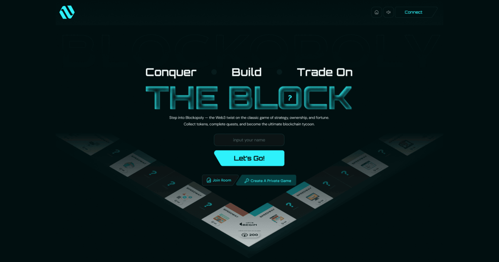

# � AgroShield MiniPay Frontend



## 📌 Overview

AgroShield MiniPay Frontend is the user interface for the decentralized agricultural insurance payment system built on Starknet. Powered by **Next.js**, **Tailwind CSS**, **Starknet-React**, and **Cartridge**, it delivers a modern, responsive UI that connects seamlessly to the on-chain insurance logic implemented in Cairo and Dojo. Farmers can interact with the payment system, manage insurance premiums, and handle claims in a trustless, blockchain-powered environment.

## ✨ Features

- **Responsive Insurance UI**: Vibrant insurance board, policy cards, risk assessment tools, and modals designed from Figma, styled with Tailwind CSS.
- **Starknet Integration**: Connect wallets, execute transactions, and query game state using Starknet-React and Cartridge.
- **On-Chain Interaction**: Real-time updates for policy purchases, risk assessments, and claims via Starknet's ZK-Rollups.
- **Account Abstraction**: Gasless or simplified transactions for a smooth UX with Cartridge.
- **TypeScript Support**: Type-safe code for robust development, aligned with the backend contracts.
- **Decentralized Gameplay**: Frontend reflects the trustless game logic enforced by Cairo smart contracts.

## 🔧 Tech Stack

- **Next.js 15.3.3**: App Router for fast, server-rendered React pages.
- **Tailwind CSS v4**: Modern, customizable styling for the Monopoly aesthetic.
- **Starknet-React**: Hooks for wallet connection, transaction execution, and state queries on Starknet.
- **Cartridge**: Simplifies account abstraction and Starknet wallet interactions.
- **TypeScript**: Strong typing for components and blockchain interactions.
- **ESLint**: Enforces code quality, integrated with Next.js rules.
- **Figma**: Source of the UI design for the game board and components.

## 🚀 Getting Started

### Prerequisites

- Node.js >= 18.0.0
- npm or yarn
- Starknet wallet (e.g., Argent X or Braavos)
- Access to the Tycoon backend contracts (see [Cairo repo](https://github.com/SaboStudios/Tycoon))

### 1️⃣ Clone the Repository

```bash
git clone https://github.com/SaboStudios/Tycoon-frontend-v1.git
cd Tycoon_Frontend
2️⃣ Install Dependencies
bash
npm install
```
